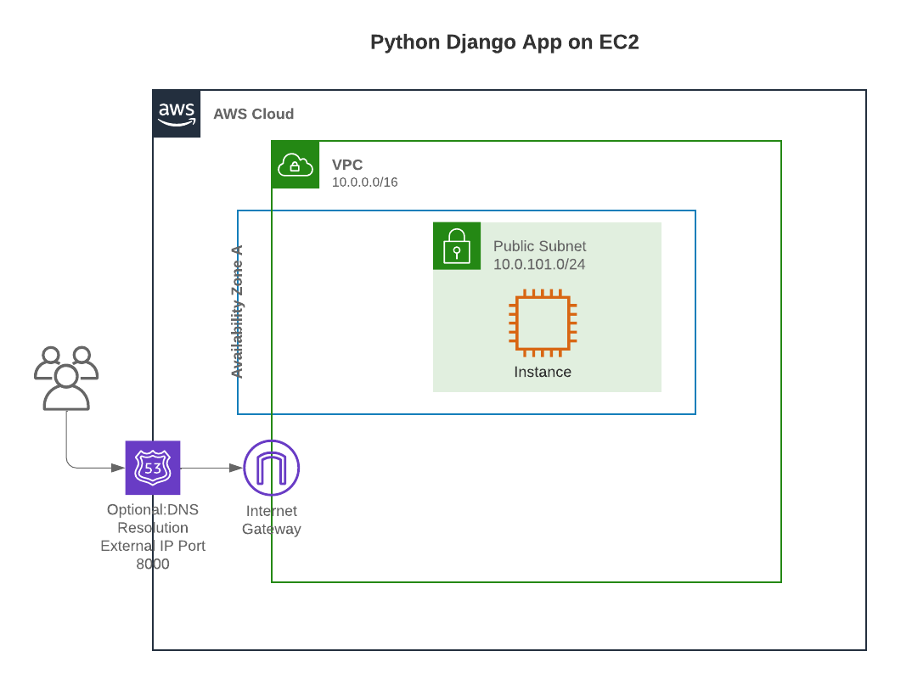

# Python Django Website Deployed Via Terraform On EC2 Instance

Automatic deployment and management of a Django website using Docker, Terraform, and EC2 instances in AWS.

<p align="center" width="100%">

</p>

## What, Why, How

* **What?** This is a Terraform stack to construct, deploy and manage a website with EC2 instances.

* **Why?** To demonstrate running a simple website in AWS on an EC2 instance.

* **How?** This repo contains the Docker Compose files to run a Django website locally and also in AWS on an EC2 instance.

## Prerequisites

* AWS profile configuration and credentials set.
  [AWS CLI Configuration User Guide](https://docs.aws.amazon.com/cli/latest/userguide/cli-configure-files.html)
* AWS Region specified in ./terraform/variables.tfvars file.
* Optional Namespace setting for your stack set in ./terraform/variables.tfvars.

## Quickstart One Step Deploy

Set the prerequisite information, and then from the root of this repo, run:

```text
make apply
```

This will begin the Terraform process in your AWS account and region specified in the ./terraform/variables.tfvars file noted above in the prerequisites.  The image used in the EC2 instance to run the website can be found on Docker Hub at
[nungster/ec2_website](https://hub.docker.com/repository/docker/nungster/ec2_website/general)
or pulled via

```text
docker pull nungster/ec2_website:latest
```

## Implementation details

The stack created by this terraform module is composed of:

* Compute
  * EC2 instance
* Network
  * Virtual Private Cloud
  * Internet Gateway
  * Security Group
  * Subnet
* Security
  * SSH Key Pair

## Input/Output

### Input

| Name | Description | Type | Default | Required |
|------|-------------|:----:|:-----:|:-----:|
| aws-profile | The name of the AWS shared credentials account. | string | `aws-profile` | yes |
| aws-region | The AWS region | string | `aws-region` | yes |

### Outputs

| Name | Description |
|------|-------------|
| browser_connection_string | The URL of the website |
| ssh_connection_string | SSH connection string to the webserver |

## ToDo's

* Split out Database to RDS
* Use ECR for Docker image Repository instead of a public repo
* IAM roles and policies to allow EC2 instances to read and pull ECR images
* Implement load balancing and ability to use more EC2 instances
